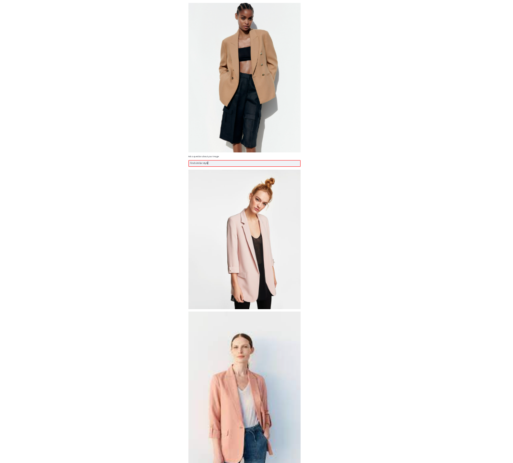
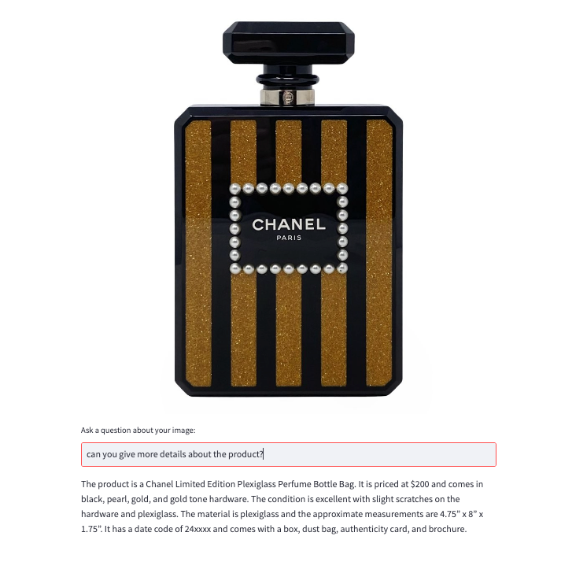
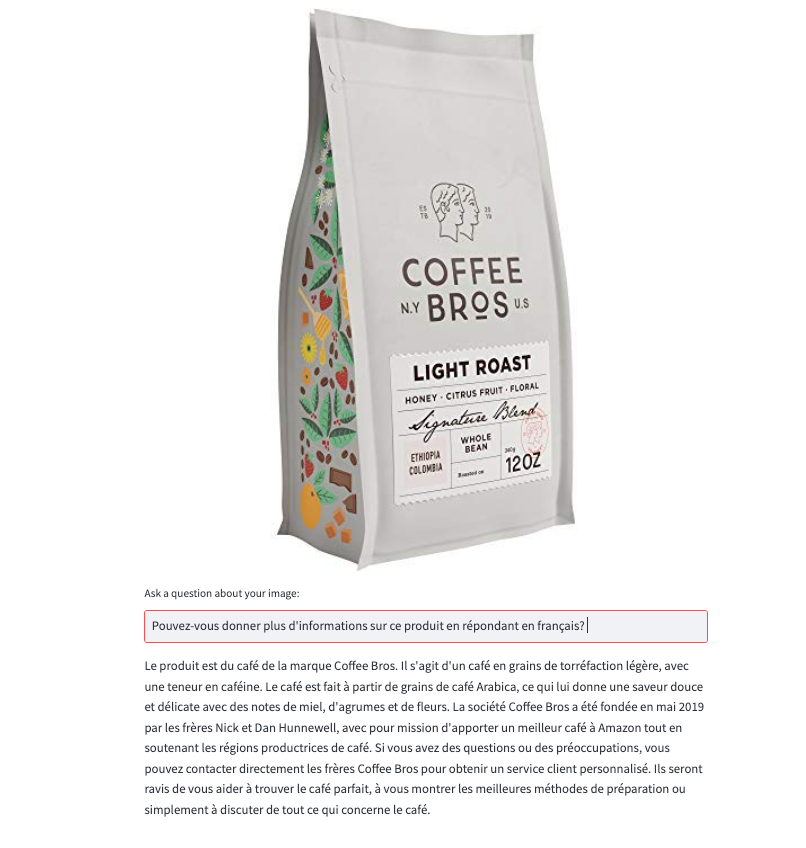
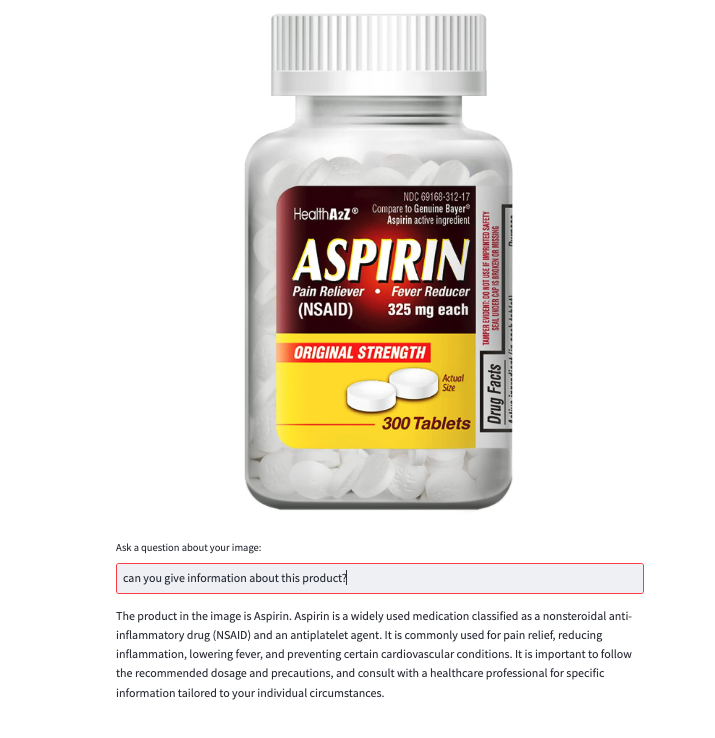
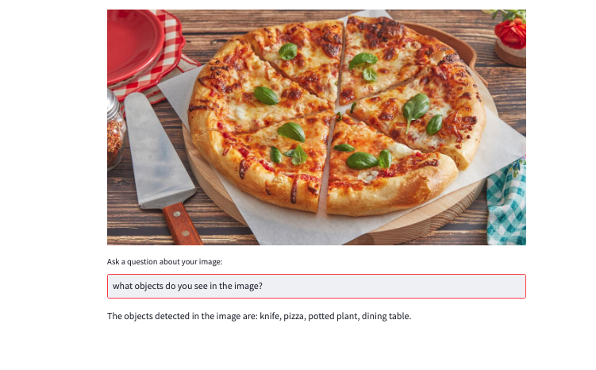

# Augmented Customer Experience


# Data Preparation:

* Table creation:

``` 
CREATE TABLE vector.t_images (
    id int PRIMARY KEY,
    item_vector vector<float, 512>,
    name text
) 
```

```
CREATE CUSTOM INDEX image_index ON vector.t_images (item_vector) USING 'StorageAttachedIndex';
```

 
```
CREATE TABLE vector.ret_table (
    document_id text PRIMARY KEY,
    document text,
    embedding_vector vector<float, 1536>,
    metadata_blob text
)
```

```
CREATE CUSTOM INDEX ret_table_embedding_idx ON vector.ret_table (embedding_vector) USING 'org.apache.cassandra.index.sai.StorageAttachedIndex';
```

* Loading the initial data to the tables

```
python embeddata.py
python loadimages.py
```


 # Augmented Customer Experience in Retail

## Why augmented customer experience?

By 2024, retail consumers will spend over $142 billion via chatbots — up from $2.8 billion in 2019 [Insider Intelligence Report](https://www.insiderintelligence.com/). LLMs and Vector Search can offer valuable assistance to the retail industry in several key areas:

## Demo:

### Product Recommendation for Online and Mobile App:

The demonstration shows how customers can use a mobile app/online to ask for product recommendations either online or in a store. While in the store, customers can snap a photo of a product and browse through similar options. They can also obtain location details to easily locate these products within the store. This allows customers to easily explore different options without the need to search for assistance from store staff. It also helps stores serve customers more efficiently, especially during busy periods.

### In-Store Virtual Assistant:

The demo also shows that customers can take a picture of a product to get additional information about it. This information may include whether it is gluten-free, what material it is made of, and where they can find different sizes of the same shoes. This also allows customers to easily get more information without the need to search for assistance from store staff.

Retailers could implement APIs to access information from the internet and demonstrate that they offer the best price for a product.

* Product Recommendation for Online and Mobile App:

 

* In-Store Mobile App:





* Medicine Information:



* Image Capturing:

 

* Object Detection:



The solution is based on Streamlit, Langchain (Agents), OpenAI (text-embedding-ada-002, gpt-3.5-turbo), Astra Vector Search, and Huggin Face (pipelines, sentence_transformers).

### Step 1: Initializing the Agent with Tools

This code sets up an agent for chat-based conversations that can utilize multiple tools and interact with users using the chosen LLM model (gpt-3.5-turbo). The agent is designed to use a combination of tools, including an image captioning tool, an object detection tool, a similarity tool, and an OCR (Optical Character Recognition) search tool.


```
##############################
### initialize agent #########
##############################
tools = [ImageCaptionTool(), ObjectDetectionTool(), Similarity(), OCRSearch()]
config = dotenv_values('.env')
openai_key = config['OPENAI_API_KEY']

conversational_memory = ConversationBufferWindowMemory(
    memory_key='chat_history',
    k=5,
    return_messages=True
)

llm = ChatOpenAI(
    openai_api_key=openai_key,
    temperature=0,
    model_name="gpt-3.5-turbo"
)

agent = initialize_agent(
    agent="chat-conversational-react-description",
    tools=tools,
    llm=llm,
    max_iterations=5,
    verbose=True,
    memory=conversational_memory,
    early_stopping_method='generate'
)
```

### Step 2: Using Streamlit to load an image

We are using Streamlit as a user interface for users to upload images and ask questions about those images. The code uses the agent to generate responses based on the user's questions and the uploaded images.

```
# set title
st.title('Ask a question to similar style or more information about a product or description of the image?')
# set header
st.header("Please upload an image")
# upload file
#file = st.camera_input("Take a picture")
file = st.file_uploader("", type=["jpeg", "jpg", "png"])


if file:
    # display image
    st.image(file, use_column_width=True)
    # text input
    user_question = st.text_input('Ask a question about your image:')

    ##############################
    ### compute agent response ###
    ##############################
    with NamedTemporaryFile(dir='.') as f:
        f.write(file.getbuffer())
        image_path = f.name

        # write agent response
        if user_question and user_question != "":
            with st.spinner(text="In progress..."):
                response = agent.run('{}, this is the image path: {}'.format(user_question, image_path))
                st.write(response)
```

### Step 3: Preparing Tools for Similarity Search and OCRSearch

This code introduces two tools, Similarity and OCRSearch, which serve as tools in a question-answering system involving images.

The Similarity tool is utilized to identify similarities within the Astra database. It uses the SentenceTransformer library to encode the image and compare it with other images in the database. The three most similar images are then presented on the screen.

On the other hand, the OCRSearch tool is employed to extract information from an image representing a product. It uses the impira/layoutlm-document-qa model to perform OCR (Optical Character Recognition) on the image and extract text. Additionally, it uses an OpenAI text embedding model (text-embedding-ada-002) to compare the extracted text with a database of product information. The most relevant product information is then displayed on the screen.

Instead of using OCR, another option could be to get product details by embedding the images and utilizing vector search to retrieve the relevant information from AstraDB.

These tools enable users to ask questions about images and receive relevant information in response.

```
### Similarity Search tool #########
class Similarity(BaseTool):
    name = "Similarity"
    description = "Use this tool when given the path to an image that you find similarities in the vector database " \
                    "The result will be shown as images "

    def _run(self, img_path):
        KEYSPACE_NAME = 'vector'
        TABLE_NAME = 't_images' 
        model = SentenceTransformer('clip-ViT-B-32')
        img_emb1 = model.encode(Image.open(img_path))
        image_data = [(1, img_path,img_emb1.tolist())]
        
        for image in image_data:
            session.execute(f"INSERT INTO {KEYSPACE_NAME}.{TABLE_NAME} (id,name,item_vector) VALUES {image}")
        
        for row in session.execute(f"SELECT id,name, item_vector FROM {KEYSPACE_NAME}.{TABLE_NAME} ORDER BY item_vector ANN OF {img_emb1.tolist()} LIMIT 3"):
            if row.id != 1:
               res = row.name 
               # display image
               st.image("/Users/betuloreilly/llmdemos/agentswithimages/images/"+res, use_column_width=True)

        return res 

    def _arun(self, query: str):
        raise NotImplementedError("This tool does not support async")

### Character Recognition and Vector Search tool #########
class OCRSearch(BaseTool):
    name = "OCRSearch"
    description = "Use this tool when given the path to an image that you are asked more information about a product " \
                    "The outcomes will be presented in the form of sentences."

    def _run(self, img_path):
        image = Image.open(img_path).convert('RGB')
        nlp = pipeline("document-question-answering", model="impira/layoutlm-document-qa",)  #a better OCR model can be used.
        res = nlp(image,"What is written in the image?")  
        KEYSPACE_NAME = 'vector'
        TABLE_NAME = 'retail'
        model_id = "text-embedding-ada-002"
        embedding = openai.Embedding.create(input=str(res), model=model_id)['data'][0]['embedding']
        for row in session.execute(f"SELECT document_id,document,embedding_vector FROM {KEYSPACE_NAME}.{TABLE_NAME} ORDER BY embedding_vector ANN OF {embedding} LIMIT 1"):
                ret_res = row.document 

        return ret_res 

    def _arun(self, query: str):
        raise NotImplementedError("This tool does not support async")

```